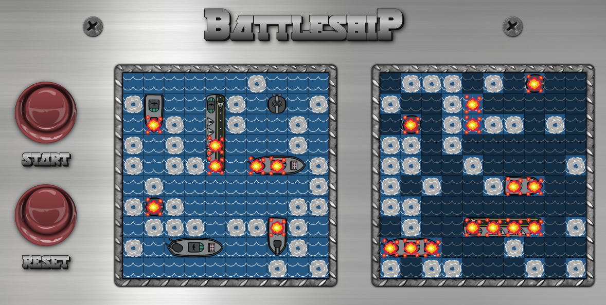

# JavaScript project: Battleship Game

### Core Functionalities 
- Allows placing ships by Drag&Drop.
- Allows handling horizontal/vertical placement of a ship by single click.
- Allows playing against computer. (only randomized moves, no ai)



Authors: <a href="https://github.com/btuerker">Burhan Tuerker</a> / <a href="https://github.com/madcido">Fabio Carmo</a>

Live Preview: https://raw.githack.com/btuerker/js-battleship/master/dist/index.html

## Installation Guide
### Prerequisities
System dependencies:
```
$ node -v
  v10.15.3

$ npm -v
  6.4.1

$ webpack -v
  4.34.0
```

#### Local setup
##### Clone project
```
$ git clone https://github.com/btuerker/js-battleship.git
$ cd ./js-battleship
```
##### Install dependencies
```
$ npm install
```
##### Build project
```
$ npm run build
```

Now, you can check the ./dist/index.html file with your best browser.
